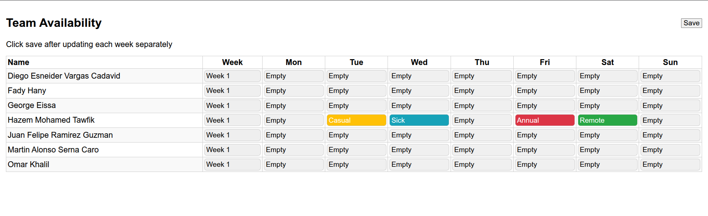

# 🚀 App Deployment with Docker

This project demonstrates how to **build and deploy a Node.js application** using a **Dockerfile** and a simple **run-script.sh** for easy startup.

---

## ⚙️ Prerequisites

Make sure you have the following installed:

- [Docker](https://docs.docker.com/get-docker/)

---
## ⚙️ Files

### 🐳 Dockerfile

This Dockerfile creates a lightweight, production-ready image for your Node.js app

### 🧩 run-script.sh

The run-script.sh file automates the Docker build and run process

### 🧩 stop-script.sh

The stop-script.sh file stops docker container 

### 🧩 rm-script.sh

The run-script.sh file removes docker container

---

## 📦 Image from project

---

## ▶️ How to Run

Build and start the container:

./run-script.sh

Open the app in your browser:
👉 http://localhost:3000
